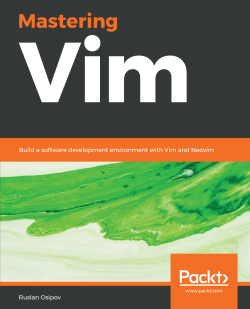

# 《Mastering Vim》Learning Notes


## 1. Profiles



|    **Title**    | **Mastering Vim** [ISBN: 9781789341096] |
| :-------------: | :----------------------------------------------------------: |
|   **Author**    |               **Ruslan Osipov**               |
| **Publication** |                      **Packt, 2018.11**                       |
|    **Pages**    |                           **330**                            |

> **Introduction**
>
> Vim is a ubiquitous text editor that can be used for all programming languages. It has an extensive plugin system and integrates with many tools. Vim offers an extensible and customizable development environment for programmers, making it one of the most popular text editors in the world.
> 
> Mastering Vim begins with explaining how the Vim editor will help you build applications efficiently. With the fundamentals of Vim, you will be taken through the Vim philosophy. As you make your way through the chapters, you will learn about advanced movement, text operations, and how Vim can be used as a Python (or any other language for that matter) IDE. The book will then cover essential tasks, such as refactoring, debugging, building, testing, and working with a version control system, as well as plugin configuration and management. In the concluding chapters, you will be introduced to additional mindset guidelines, learn to personalize your Vim experience, and go above and beyond with Vimscript.
> 
> By the end of this book, you will be sufficiently confident to make Vim (or its fork, Neovim) your first choice when writing applications in Python and other programming languages.


## 2. Outlines

Status available：:heavy_check_mark: (Completed) | :hourglass_flowing_sand: (Working) | :no_entry: (Not Started) | :orange_book: (Finish reading)

|        No.        | Chapter Title  |          Status          |
| :---------------: | :------------: | :----------------------: |
| [Ch01](./Ch01.md) | Getting Started | :no_entry: |
| [Ch02](./Ch02.md) | Advanced Editing and Navigation | :no_entry: |
| [Ch03](./Ch03.md) | Follow the Leader – Plugin Management | :no_entry: |
| [Ch04](./Ch04.md) | Understanding the Text | :no_entry: |
| [Ch05](./Ch05.md) | Build, Test, and Execute | :no_entry: |
| [Ch06](./Ch06.md) | Refactoring Code with Regex and Macros | :no_entry: |
| [Ch07](./Ch07.md) | Making Vim Your Own | :no_entry: |
| [Ch08](./Ch08.md) | Transcending the Mundane with Vimscript | :no_entry: |
| [Ch09](./Ch09.md) | Neovim | :no_entry: |
| [Ch10](./Ch10.md) | Where to Go from Here | :no_entry: |


Powershell script for generating markdown files in batch:

```powershell
# Create 10 empty markdown files named Ch##.md:
for($i=1; $i -le 10; $i=$i+1){ New-Item -Name "Ch$('{0:d2}' -f $i).md"; }
```

 
